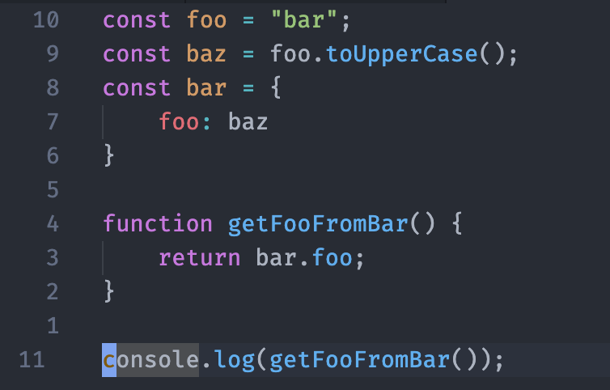

# README
## Atom One Dark (but not so much)
This theme is based on Atom One Dark, from Mahmoud Ali, inspired by the Atom One Dark shipped with Pycharm.

The few modifications from the base theme are:

- Variables foreground are white-gray
- Variables methods/properties are blue(ish)
- Carret is lighter in color, as to increase contrast with the highlighted character

## Preview

### For more information
* [Visual Studio Code's Markdown Support](http://code.visualstudio.com/docs/languages/markdown)
* [Markdown Syntax Reference](https://help.github.com/articles/markdown-basics/)

**Enjoy!**
